# Molecular Structure Checking using BioExcel Building Blocks (biobb)

***
This tutorial aims to illustrate the process of **checking** a **molecular structure** before using it as an input for a **Molecular Dynamics** simulation. The workflow uses the **BioExcel Building Blocks library (biobb)**. The particular structure used is the crystal structure of **human Adenylate Kinase 1A (AK1A)**, in complex with the **AP5A inhibitor** (PDB code [1Z83](https://www.rcsb.org/structure/1z83), [https://doi.org/10.2210/pdb1Z83/pdb](https://doi.org/10.2210/pdb1Z83/pdb)).  

**Structure checking** is a key step before setting up a protein system for **simulations**. A number of **common issues** found in structures at **Protein Data Bank** may compromise the success of the **simulation**, or may suggest that longer **equilibration** procedures are necessary.

The **workflow** shows how to:

- Run **basic manipulations on structures** (selection of models, chains, alternative locations
- Detect and fix **amide assignments** and **wrong chiralities**
- Detect and fix **protein backbone** issues (missing fragments, and atoms, capping)
- Detect and fix **missing side-chain atoms**
- **Add hydrogen atoms** according to several criteria
- Detect and classify **atomic clashes**
- Detect possible **disulfide bonds (SS)**

***NOTE***: 
- Some of the workflow steps work with **AMBER force-field nomenclature** (e.g. CYX, HID, HIE), and thus the output structure might be slightly modified to use it with different **force-fields**. 

An implementation of this workflow in a **web-based Graphical User Interface (GUI)** can be found in the https://mmb.irbbarcelona.org/biobb-wfs/ server (see https://mmb.irbbarcelona.org/biobb-wfs/help/create/structure#check).

***

## Settings

### Biobb modules used

 - [biobb_io](https://github.com/bioexcel/biobb_io): Tools to fetch biomolecular data from public databases.
 - [biobb_structure_utils](https://github.com/bioexcel/biobb_structure_utils): Tools to modify or extract information from a PDB structure.
 - [biobb_model](https://github.com/bioexcel/biobb_model): Tools to check and model 3D structures, create mutations or reconstruct missing atoms.
 - [biobb_amber](https://github.com/bioexcel/biobb_amber): Tools to setup and simulate atomistic MD simulations using AMBER MD package.
 - [biobb_chemistry](https://github.com/bioexcel/biobb_chemistry): Tools to perform chemoinformatics on molecular structures.
  
### Auxiliar libraries used

* [modeller](https://salilab.org/modeller/): Software used for homology or comparative modeling of protein three-dimensional structures.
* [jupyter](https://jupyter.org/): Free software, open standards, and web services for interactive computing across all programming languages.
* [nglview](http://nglviewer.org/#nglview): Jupyter/IPython widget to interactively view molecular structures and trajectories in notebooks.
* [plotly](https://plot.ly/python/offline/): Python interactive graphing library integrated in Jupyter notebooks.

### Conda Installation and Launch

```console
git clone https://github.com/bioexcel/biobb_wf_structure_checking.git
cd biobb_wf_structure_checking
conda env create -f conda_env/environment.yml
conda activate biobb_wf_structure_checking
jupyter-notebook biobb_wf_structure_checking/notebooks/biobb_wf_structure_checking.ipynb
```

***
## Pipeline steps
 1. [Input Parameters](#input)
 2. [Fetching PDB structure](#fetch)
 3. [PDB structure checking](#PDBchecking)
     1. [Models](#models)
     2. [Chains](#chains)
     3. [Alternative Locations](#altlocs) 
     4. [Disulfide Bridges](#ss)
     5. [Metal Ions](#metals)
     6. [Ligands](#ligands)
     7. [Hydrogen Atoms](#hydrogens)
     8. [Water Molecules](#water)
     9. [Amide Groups](#amide)
     10. [Chirality](#chirality)
     11. [Missing Side Chain Atoms](#sidechains)
     12. [Missing Backbone Atoms](#backbone)     
     13. [Atomic Clashes](#clashes)
     14. [Final Check](#finalcheck)
 8. [Questions & Comments](#questions)
 
***

***

<a id="input"></a>
## Input parameters
**Input parameters** needed:
 - **pdbCode**: PDB code of the protein structure (e.g. 1Z83, [https://doi.org/10.2210/pdb1Z83/pdb](https://doi.org/10.2210/pdb1Z83/pdb))


```python
import nglview
import ipywidgets

pdbCode = "1z83" # Should be replaced to check different structures 
```

<a id="fetch"></a>
***
## Fetching PDB structure
Downloading **PDB structure** with the **protein molecule** from the RCSB PDB database.<br>
Alternatively, a **PDB file** can be used as starting structure. <br>
***
**Building Blocks** used:
 - [Pdb](https://biobb-io.readthedocs.io/en/latest/api.html#module-api.pdb) from **biobb_io.api.pdb**
***


```python
# Downloading desired PDB file 
# Import module
from biobb_io.api.pdb import pdb

# Create properties dict and inputs/outputs
downloaded_pdb = pdbCode+'.pdb'
prop = {
    'pdb_code': pdbCode,
    'filter': ['ATOM', 'HETATM'],
}

#Create and launch bb
pdb(output_pdb_path=downloaded_pdb,
    properties=prop)
```

<a id="vis3D"></a>
### Visualizing 3D structure
Visualizing the downloaded/given **PDB structure** using **NGL**: 


```python
# Show original structure
view = nglview.show_structure_file(downloaded_pdb)
view.add_representation(repr_type='spacefill', selection='ion')
view.add_representation(repr_type='spacefill', radius='0.3', selection='water')
view._remote_call('setSize', target='Widget', args=['','400px'])
view
```

</img>

<a id="PDBchecking"></a>
***
## PDB structure checking
The first step of the workflow is a complete **checking** of the **molecular structure**. The **BioBB** utility **structure_check** parses the whole **PDB file**, runs a complete **structure checking**, saves **useful information** about the structure and looks for **possible issues**. The block is printing a **report** of the information extracted from the **input structure**. 
***
**Building Blocks** used:
 - [structure_check](https://biobb-structure-utils.readthedocs.io/en/latest/utils.html#module-utils.structure_check) from **biobb_structure_utils.utils.structure_check**
***


```python
from biobb_structure_utils.utils.structure_check import structure_check

report = pdbCode + ".report.json"

structure_check(
    input_structure_path=downloaded_pdb,
    output_summary_path=report
)
```

<a id="StepByStep"></a>
***
## Structure checking, step by step
The **workflow** will go through the **report**, exploring all the different **features** analysed. The following cell is showing the **full content** of the **report**.
***


```python
import json
with open(report, 'r') as f:
  data = json.load(f)
print(json.dumps(data, indent=2))
```

    {
      "FASTA": {
        "canonical": "",
        "structure": ">pdb_sq_A Frags: 0-194\nSMEEKLKKTNIIFVVGGPGSGKGTQCEKIVQKYGYTHLSTGDLLRSEVSSGSARGKKLSE\nIMEKGQLVPLETVLDMLRDAMVAKVNTSKGFLIDGYPREVQQGEEFERRIGQPTLLLYVD\nAGPETMTQRLLKRGETSGRVDDNEETIKKRLETYYKATEPVIAFYEKRGIVRKVNAEGSV\nDSVFSQVCTHLDALL\n>pdb_sq_B Frags: 0-194\nSMEEKLKKTNIIFVVGGPGSGKGTQCEKIVQKYGYTHLSTGDLLRSEVSSGSARGKKLSE\nIMEKGQLVPLETVLDMLRDAMVAKVNTSKGFLIDGYPREVQQGEEFERRIGQPTLLLYVD\nAGPETMTQRLLKRGETSGRVDDNEETIKKRLETYYKATEPVIAFYEKRGIVRKVNAEGSV\nDSVFSQVCTHLDALL\n>pdb_sq_C Frags: 0-194\nSMEEKLKKTNIIFVVGGPGSGKGTQCEKIVQKYGYTHLSTGDLLRSEVSSGSARGKKLSE\nIMEKGQLVPLETVLDMLRDAMVAKVNTSKGFLIDGYPREVQQGEEFERRIGQPTLLLYVD\nAGPETMTQRLLKRGETSGRVDDNEETIKKRLETYYKATEPVIAFYEKRGIVRKVNAEGSV\nDSVFSQVCTHLDALL\n"
      },
      "add_hydrogen": {
        "ionic_detected": [
          "GLU A2",
          "GLU A3",
          "LYS A4",
          "LYS A6",
          "LYS A7",
          "LYS A21",
          "CYS A25",
          "GLU A26",
          "LYS A27",
          "LYS A31",
          "TYR A32",
          "TYR A34",
          "HIS A36",
          "ASP A41",
          "ARG A44",
          "GLU A46",
          "ARG A53",
          "LYS A55",
          "LYS A56",
          "GLU A59",
          "GLU A62",
          "LYS A63",
          "GLU A70",
          "ASP A74",
          "ARG A77",
          "ASP A78",
          "LYS A83",
          "LYS A88",
          "ASP A93",
          "TYR A95",
          "ARG A97",
          "GLU A98",
          "GLU A103",
          "GLU A104",
          "GLU A106",
          "ARG A107",
          "ARG A108",
          "TYR A117",
          "ASP A119",
          "GLU A123",
          "ARG A128",
          "LYS A131",
          "ARG A132",
          "GLU A134",
          "ARG A138",
          "ASP A140",
          "ASP A141",
          "GLU A143",
          "GLU A144",
          "LYS A147",
          "LYS A148",
          "ARG A149",
          "GLU A151",
          "TYR A153",
          "TYR A154",
          "LYS A155",
          "GLU A158",
          "TYR A164",
          "GLU A165",
          "LYS A166",
          "ARG A167",
          "ARG A171",
          "LYS A172",
          "GLU A176",
          "ASP A180",
          "CYS A187",
          "HIS A189",
          "ASP A191",
          "GLU B2",
          "GLU B3",
          "LYS B4",
          "LYS B6",
          "LYS B7",
          "LYS B21",
          "CYS B25",
          "GLU B26",
          "LYS B27",
          "LYS B31",
          "TYR B32",
          "TYR B34",
          "HIS B36",
          "ASP B41",
          "ARG B44",
          "GLU B46",
          "ARG B53",
          "LYS B55",
          "LYS B56",
          "GLU B59",
          "GLU B62",
          "LYS B63",
          "GLU B70",
          "ASP B74",
          "ARG B77",
          "ASP B78",
          "LYS B83",
          "LYS B88",
          "ASP B93",
          "TYR B95",
          "ARG B97",
          "GLU B98",
          "GLU B103",
          "GLU B104",
          "GLU B106",
          "ARG B107",
          "ARG B108",
          "TYR B117",
          "ASP B119",
          "GLU B123",
          "ARG B128",
          "LYS B131",
          "ARG B132",
          "GLU B134",
          "ARG B138",
          "ASP B140",
          "ASP B141",
          "GLU B143",
          "GLU B144",
          "LYS B147",
          "LYS B148",
          "ARG B149",
          "GLU B151",
          "TYR B153",
          "TYR B154",
          "LYS B155",
          "GLU B158",
          "TYR B164",
          "GLU B165",
          "LYS B166",
          "ARG B167",
          "ARG B171",
          "LYS B172",
          "GLU B176",
          "ASP B180",
          "CYS B187",
          "HIS B189",
          "ASP B191",
          "GLU C2",
          "GLU C3",
          "LYS C4",
          "LYS C6",
          "LYS C7",
          "LYS C21",
          "CYS C25",
          "GLU C26",
          "LYS C27",
          "LYS C31",
          "TYR C32",
          "TYR C34",
          "HIS C36",
          "ASP C41",
          "ARG C44",
          "GLU C46",
          "ARG C53",
          "LYS C55",
          "LYS C56",
          "GLU C59",
          "GLU C62",
          "LYS C63",
          "GLU C70",
          "ASP C74",
          "ARG C77",
          "ASP C78",
          "LYS C83",
          "LYS C88",
          "ASP C93",
          "TYR C95",
          "ARG C97",
          "GLU C98",
          "GLU C103",
          "GLU C104",
          "GLU C106",
          "ARG C107",
          "ARG C108",
          "TYR C117",
          "ASP C119",
          "GLU C123",
          "ARG C128",
          "LYS C131",
          "ARG C132",
          "GLU C134",
          "ARG C138",
          "ASP C140",
          "ASP C141",
          "GLU C143",
          "GLU C144",
          "LYS C147",
          "LYS C148",
          "ARG C149",
          "GLU C151",
          "TYR C153",
          "TYR C154",
          "LYS C155",
          "GLU C158",
          "TYR C164",
          "GLU C165",
          "LYS C166",
          "ARG C167",
          "ARG C171",
          "LYS C172",
          "GLU C176",
          "ASP C180",
          "CYS C187",
          "HIS C189",
          "ASP C191"
        ]
      },
      "altloc": {
        "ASN A85": {
          "CA": [
            {
              "loc_label": "A",
              "occupancy": 0.5
            },
            {
              "loc_label": "B",
              "occupancy": 0.5
            }
          ],
          "CB": [
            {
              "loc_label": "A",
              "occupancy": 0.5
            },
            {
              "loc_label": "B",
              "occupancy": 0.5
            }
          ],
          "CG": [
            {
              "loc_label": "A",
              "occupancy": 0.5
            },
            {
              "loc_label": "B",
              "occupancy": 0.5
            }
          ],
          "ND2": [
            {
              "loc_label": "A",
              "occupancy": 0.5
            },
            {
              "loc_label": "B",
              "occupancy": 0.5
            }
          ],
          "OD1": [
            {
              "loc_label": "A",
              "occupancy": 0.5
            },
            {
              "loc_label": "B",
              "occupancy": 0.5
            }
          ]
        },
        "GLU B165": {
          "CA": [
            {
              "loc_label": "A",
              "occupancy": 0.5
            },
            {
              "loc_label": "B",
              "occupancy": 0.5
            }
          ],
          "CB": [
            {
              "loc_label": "A",
              "occupancy": 0.5
            },
            {
              "loc_label": "B",
              "occupancy": 0.5
            }
          ],
          "CD": [
            {
              "loc_label": "A",
              "occupancy": 0.5
            },
            {
              "loc_label": "B",
              "occupancy": 0.5
            }
          ],
          "CG": [
            {
              "loc_label": "A",
              "occupancy": 0.5
            },
            {
              "loc_label": "B",
              "occupancy": 0.5
            }
          ],
          "OE1": [
            {
              "loc_label": "A",
              "occupancy": 0.5
            },
            {
              "loc_label": "B",
              "occupancy": 0.5
            }
          ],
          "OE2": [
            {
              "loc_label": "A",
              "occupancy": 0.5
            },
            {
              "loc_label": "B",
              "occupancy": 0.5
            }
          ]
        },
        "GLU C143": {
          "CA": [
            {
              "loc_label": "A",
              "occupancy": 0.5
            },
            {
              "loc_label": "B",
              "occupancy": 0.5
            }
          ],
          "CB": [
            {
              "loc_label": "A",
              "occupancy": 0.5
            },
            {
              "loc_label": "B",
              "occupancy": 0.5
            }
          ],
          "CD": [
            {
              "loc_label": "A",
              "occupancy": 0.5
            },
            {
              "loc_label": "B",
              "occupancy": 0.5
            }
          ],
          "CG": [
            {
              "loc_label": "A",
              "occupancy": 0.5
            },
            {
              "loc_label": "B",
              "occupancy": 0.5
            }
          ],
          "OE1": [
            {
              "loc_label": "A",
              "occupancy": 0.5
            },
            {
              "loc_label": "B",
              "occupancy": 0.5
            }
          ],
          "OE2": [
            {
              "loc_label": "A",
              "occupancy": 0.5
            },
            {
              "loc_label": "B",
              "occupancy": 0.5
            }
          ]
        },
        "SER A45": {
          "CA": [
            {
              "loc_label": "A",
              "occupancy": 0.5
            },
            {
              "loc_label": "B",
              "occupancy": 0.5
            }
          ],
          "CB": [
            {
              "loc_label": "A",
              "occupancy": 0.5
            },
            {
              "loc_label": "B",
              "occupancy": 0.5
            }
          ],
          "OG": [
            {
              "loc_label": "A",
              "occupancy": 0.5
            },
            {
              "loc_label": "B",
              "occupancy": 0.5
            }
          ]
        },
        "VAL A67": {
          "CA": [
            {
              "loc_label": "A",
              "occupancy": 0.5
            },
            {
              "loc_label": "B",
              "occupancy": 0.5
            }
          ],
          "CB": [
            {
              "loc_label": "A",
              "occupancy": 0.5
            },
            {
              "loc_label": "B",
              "occupancy": 0.5
            }
          ],
          "CG1": [
            {
              "loc_label": "A",
              "occupancy": 0.5
            },
            {
              "loc_label": "B",
              "occupancy": 0.5
            }
          ],
          "CG2": [
            {
              "loc_label": "A",
              "occupancy": 0.5
            },
            {
              "loc_label": "B",
              "occupancy": 0.5
            }
          ]
        }
      },
      "amide": {
        "n_amides": 36
      },
      "backbone": {
        "missing_atoms": {
          "LEU A194": [
            "OXT"
          ],
          "LEU B194": [
            "OXT"
          ],
          "LEU C194": [
            "OXT"
          ]
        }
      },
      "chains": {
        "A": "Protein/0",
        "B": "Protein/0",
        "C": "Protein/0",
        "unlabelled": false
      },
      "chiral": {
        "n_chirals": 69
      },
      "chiral_bck": {
        "n_chirals": 528
      },
      "cistransbck": {
        "cis": [
          [
            "TYR A95",
            "PRO A96",
            2.032
          ],
          [
            "TYR B95",
            "PRO B96",
            -3.952
          ],
          [
            "TYR C95",
            "PRO C96",
            3.605
          ],
          [
            "SER C136",
            "GLY C137",
            1.028
          ]
        ]
      },
      "clashes": {
        "detected": {
          "apolar": [
            {
              "at1": "GLU A46.OE1",
              "at2": "MET A75.CE",
              "dist": 2.651
            },
            {
              "at1": "ARG A53.O",
              "at2": "LYS A56.CG",
              "dist": 2.7251
            },
            {
              "at1": "GLU A123.O",
              "at2": "GLN A127.CG",
              "dist": 2.8177
            },
            {
              "at1": "GLU B70.CD",
              "at2": " ZN B642.ZN",
              "dist": 2.893
            },
            {
              "at1": "ASP C74.CG",
              "at2": " ZN C645.ZN",
              "dist": 2.7006
            }
          ],
          "negative": [
            {
              "at1": "GLU A70.OE2",
              "at2": "ASP A74.OD2",
              "dist": 3.3062
            },
            {
              "at1": "GLU A70.OE2",
              "at2": "GLU B70.OE1",
              "dist": 3.4246
            },
            {
              "at1": "GLU A70.OE2",
              "at2": "GLU B104.OE1",
              "dist": 3.4053
            },
            {
              "at1": "ASP A74.OD1",
              "at2": "GLU B70.OE2",
              "dist": 3.1557
            },
            {
              "at1": "ASP A74.OD2",
              "at2": "GLU B104.OE1",
              "dist": 3.0494
            },
            {
              "at1": "GLU C70.OE2",
              "at2": "ASP C74.OD1",
              "dist": 3.2633
            }
          ],
          "polar_acceptor": [
            {
              "at1": "GLU A2.OE2",
              "at2": "ILE A109.O",
              "dist": 2.5821
            },
            {
              "at1": "SER A58.O",
              "at2": "GLU A62.OE2",
              "dist": 2.9717
            },
            {
              "at1": "ASP A74.OD2",
              "at2": "GLU B104.OE1",
              "dist": 3.0494
            }
          ],
          "polar_donor": [],
          "positive": [
            {
              "at1": "ARG A44.NH1",
              "at2": "ARG A138.NH1",
              "dist": 3.4254
            },
            {
              "at1": "ARG A132.NH2",
              "at2": "ARG A138.NE",
              "dist": 3.3889
            },
            {
              "at1": "LYS B6.NZ",
              "at2": "ARG C171.NH2",
              "dist": 3.439
            },
            {
              "at1": "ARG B44.NH1",
              "at2": "ARG B138.NH1",
              "dist": 3.2688
            },
            {
              "at1": "ARG B138.NH2",
              "at2": "ARG B149.NH2",
              "dist": 3.3051
            },
            {
              "at1": "ARG C44.NH1",
              "at2": "ARG C138.NH1",
              "dist": 3.3648
            },
            {
              "at1": "ARG C132.NH2",
              "at2": "ARG C138.NH1",
              "dist": 3.3057
            },
            {
              "at1": "ARG C138.NH2",
              "at2": "ARG C149.NH2",
              "dist": 3.3646
            }
          ],
          "severe": []
        }
      },
      "fixside": {
        "detected_missing": {
          "ARG C53": [
            "CD",
            "NE",
            "CZ",
            "NH1",
            "NH2"
          ],
          "GLN A127": [
            "CD",
            "OE1",
            "NE2"
          ],
          "GLN B100": [
            "CG",
            "CD",
            "OE1",
            "NE2"
          ],
          "GLN B127": [
            "CD",
            "OE1",
            "NE2"
          ],
          "GLN C127": [
            "CD",
            "OE1",
            "NE2"
          ],
          "GLU A123": [
            "CD",
            "OE1",
            "OE2"
          ],
          "GLU A143": [
            "CD",
            "OE1",
            "OE2"
          ],
          "GLU B123": [
            "CG",
            "CD",
            "OE1",
            "OE2"
          ],
          "GLU B151": [
            "CD",
            "OE1",
            "OE2"
          ],
          "GLU B3": [
            "OE1",
            "OE2"
          ],
          "GLU C123": [
            "CD",
            "OE1",
            "OE2"
          ],
          "GLU C134": [
            "CD",
            "OE1",
            "OE2"
          ],
          "GLU C2": [
            "CD",
            "OE1",
            "OE2"
          ],
          "GLU C59": [
            "CD",
            "OE1",
            "OE2"
          ],
          "LEU B193": [
            "CD1",
            "CD2"
          ],
          "LEU C193": [
            "CG",
            "CD1",
            "CD2"
          ],
          "LYS A155": [
            "CE",
            "NZ"
          ],
          "LYS A56": [
            "CD",
            "CE",
            "NZ"
          ],
          "LYS A63": [
            "CD",
            "CE",
            "NZ"
          ],
          "LYS A7": [
            "CE",
            "NZ"
          ],
          "LYS B131": [
            "CD",
            "CE",
            "NZ"
          ],
          "LYS B155": [
            "CE",
            "NZ"
          ],
          "LYS B166": [
            "CE",
            "NZ"
          ],
          "LYS B55": [
            "CD",
            "CE",
            "NZ"
          ],
          "LYS B56": [
            "CD",
            "CE",
            "NZ"
          ],
          "LYS B7": [
            "CD",
            "CE",
            "NZ"
          ],
          "LYS C131": [
            "CD",
            "CE",
            "NZ"
          ],
          "LYS C55": [
            "CE",
            "NZ"
          ],
          "LYS C56": [
            "CE",
            "NZ"
          ],
          "LYS C7": [
            "CE",
            "NZ"
          ],
          "LYS C83": [
            "CE",
            "NZ"
          ],
          "LYS C88": [
            "CE",
            "NZ"
          ]
        }
      },
      "getss": {},
      "headers": {
        "entry_id": "",
        "method": "unknown",
        "resolution": "N.A.",
        "title": ""
      },
      "inscodes": {},
      "ligands": {
        "detected": [
          " ZN A601",
          " ZN A641",
          "SO4 A702",
          "AP5 A631",
          " ZN B611",
          " ZN B642",
          " ZN B643",
          "SO4 B701",
          "SO4 B703",
          "AP5 B632",
          " ZN C621",
          " ZN C644",
          " ZN C645",
          "AP5 C633"
        ]
      },
      "loaded_structure": "/Users/gbayarri/projects/BioBB/tutorials/biobb_wf_structure_checking/biobb_wf_structure_checking/notebooks/ff4482b7-13f1-4a56-a2f1-3698589289d2/1z83.pdb",
      "metals": {
        "detected": [
          " ZN A601",
          " ZN A641",
          " ZN B611",
          " ZN B642",
          " ZN B643",
          " ZN C621",
          " ZN C644",
          " ZN C645"
        ]
      },
      "models": {
        "nmodels": 1
      },
      "rem_hydrogen": {},
      "sequences": {},
      "stats": {
        "biounit": false,
        "ca_only": false,
        "chain_guess_details": [
          {
            "A": {
              "DNA": 0.0,
              "Other": 0.02010050251256279,
              "Protein": 0.9798994974874372,
              "RNA": 0.0
            },
            "B": {
              "DNA": 0.0,
              "Other": 0.02985074626865669,
              "Protein": 0.9701492537313433,
              "RNA": 0.0
            },
            "C": {
              "DNA": 0.0,
              "Other": 0.02010050251256279,
              "Protein": 0.9798994974874372,
              "RNA": 0.0
            }
          }
        ],
        "chain_ids": [
          {
            "A": "Protein",
            "B": "Protein",
            "C": "Protein"
          }
        ],
        "models_type": 0,
        "nchains": [
          3
        ],
        "nmodels": 1,
        "stats": {
          "num_ats": 5123,
          "num_h": 0,
          "num_res": 1057,
          "num_wat": 458,
          "res_h": 0,
          "res_hetats": 472,
          "res_insc": 0,
          "res_ligands": 14
        },
        "total_charge": null
      },
      "water": {
        "n_detected": 458
      }
    }


<a id="models"></a>
##  Models
Presence of **models** in the structure. MD simulations require a single structure, although some structures (e.g. biounits) may be defined as a series of models, in such case all of them are usually required.
***
Use **BioBB extract_model** to select the desired **models**. 

 - [extract_model](https://biobb-structure-utils.readthedocs.io/en/latest/utils.html#module-utils.extract_model) from **biobb_structure_utils.utils.extract_model**
***


```python
print(json.dumps(data['models'], indent=2))
```

    {
      "nmodels": 1
    }


```python
from biobb_structure_utils.utils.extract_model import extract_model

pdb_models = pdbCode + ".models.pdb"

prop = {
    'models': [ 1 ]
}

extract_model(
    input_structure_path=downloaded_pdb,
    output_structure_path=pdb_models,
    properties=prop
)
```


```python
# Show modified structure
view = nglview.show_structure_file(pdb_models)
view.add_representation(repr_type='spacefill', selection='ion')
view.add_representation(repr_type='spacefill', radius='0.3', selection='water')
view._remote_call('setSize', target='Widget', args=['','400px'])
view
```

</img>

<a id="chains"></a>
##  Chains
Presence of **chains** in the structure. MD simulations are usually performed with complete structures. However input structure may contain **several copies of the system**, or contain **additional chains** like **peptides** or **nucleic acids** that may be removed. 
***
Use **BioBB extract_chain** to select the desired **chains**. 

 - [extract_chain](https://biobb-structure-utils.readthedocs.io/en/latest/utils.html#module-utils.extract_chain) from **biobb_structure_utils.utils.extract_chain**
***


```python
print(json.dumps(data['chains'], indent=2))
```

    {
      "A": "Protein/0",
      "B": "Protein/0",
      "C": "Protein/0",
      "unlabelled": false
    }


```python
from biobb_structure_utils.utils.extract_chain import extract_chain

pdb_chains = pdbCode + ".chains.pdb"

prop = {
    'chains': [ 'A' ]
}

extract_chain(
    input_structure_path=pdb_models,
    output_structure_path=pdb_chains,
    properties=prop
)
```


```python
# Show modified structure
view1 = nglview.show_structure_file(pdb_models)
view1.add_representation(repr_type='spacefill', selection='ion')
view1.add_representation(repr_type='spacefill', radius='0.3', selection='water')
view1._remote_call('setSize', target='Widget', args=['','600px'])
view2 = nglview.show_structure_file(pdb_chains)
view2.add_representation(repr_type='spacefill', selection='ion')
view2.add_representation(repr_type='spacefill', radius='0.3', selection='water')
view2._remote_call('setSize', target='Widget', args=['','600px'])
ipywidgets.HBox([view1, view2])
```

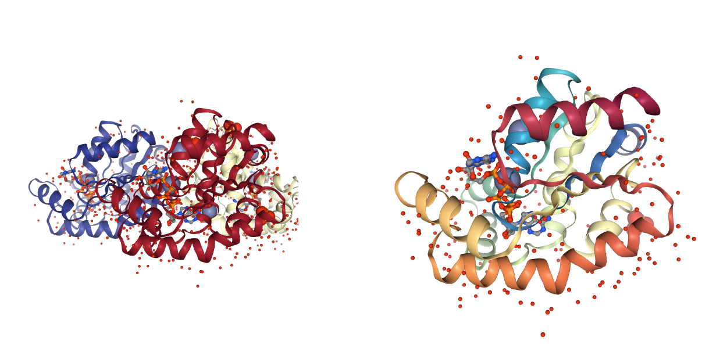</img>

<a id="altlocs"></a>
##  Alternative Locations
Presence of residues with **alternative locations**. Atoms with **alternative coordinates** and their **occupancy** are reported. MD simulations requires a **single position** for each atom. 
***
Use **BioBB fix_altloc** to select the desired **alternative locations**. 

 - [fix_altlocs](https://biobb-model.readthedocs.io/en/latest/model.html#module-model.fix_altlocs) from **biobb_model.model.fix_altlocs**
***


```python
print(json.dumps(data['altloc'], indent=2))
```

    {
      "ASN A85": {
        "CA": [
          {
            "loc_label": "A",
            "occupancy": 0.5
          },
          {
            "loc_label": "B",
            "occupancy": 0.5
          }
        ],
        "CB": [
          {
            "loc_label": "A",
            "occupancy": 0.5
          },
          {
            "loc_label": "B",
            "occupancy": 0.5
          }
        ],
        "CG": [
          {
            "loc_label": "A",
            "occupancy": 0.5
          },
          {
            "loc_label": "B",
            "occupancy": 0.5
          }
        ],
        "ND2": [
          {
            "loc_label": "A",
            "occupancy": 0.5
          },
          {
            "loc_label": "B",
            "occupancy": 0.5
          }
        ],
        "OD1": [
          {
            "loc_label": "A",
            "occupancy": 0.5
          },
          {
            "loc_label": "B",
            "occupancy": 0.5
          }
        ]
      },
      "GLU B165": {
        "CA": [
          {
            "loc_label": "A",
            "occupancy": 0.5
          },
          {
            "loc_label": "B",
            "occupancy": 0.5
          }
        ],
        "CB": [
          {
            "loc_label": "A",
            "occupancy": 0.5
          },
          {
            "loc_label": "B",
            "occupancy": 0.5
          }
        ],
        "CD": [
          {
            "loc_label": "A",
            "occupancy": 0.5
          },
          {
            "loc_label": "B",
            "occupancy": 0.5
          }
        ],
        "CG": [
          {
            "loc_label": "A",
            "occupancy": 0.5
          },
          {
            "loc_label": "B",
            "occupancy": 0.5
          }
        ],
        "OE1": [
          {
            "loc_label": "A",
            "occupancy": 0.5
          },
          {
            "loc_label": "B",
            "occupancy": 0.5
          }
        ],
        "OE2": [
          {
            "loc_label": "A",
            "occupancy": 0.5
          },
          {
            "loc_label": "B",
            "occupancy": 0.5
          }
        ]
      },
      "GLU C143": {
        "CA": [
          {
            "loc_label": "A",
            "occupancy": 0.5
          },
          {
            "loc_label": "B",
            "occupancy": 0.5
          }
        ],
        "CB": [
          {
            "loc_label": "A",
            "occupancy": 0.5
          },
          {
            "loc_label": "B",
            "occupancy": 0.5
          }
        ],
        "CD": [
          {
            "loc_label": "A",
            "occupancy": 0.5
          },
          {
            "loc_label": "B",
            "occupancy": 0.5
          }
        ],
        "CG": [
          {
            "loc_label": "A",
            "occupancy": 0.5
          },
          {
            "loc_label": "B",
            "occupancy": 0.5
          }
        ],
        "OE1": [
          {
            "loc_label": "A",
            "occupancy": 0.5
          },
          {
            "loc_label": "B",
            "occupancy": 0.5
          }
        ],
        "OE2": [
          {
            "loc_label": "A",
            "occupancy": 0.5
          },
          {
            "loc_label": "B",
            "occupancy": 0.5
          }
        ]
      },
      "SER A45": {
        "CA": [
          {
            "loc_label": "A",
            "occupancy": 0.5
          },
          {
            "loc_label": "B",
            "occupancy": 0.5
          }
        ],
        "CB": [
          {
            "loc_label": "A",
            "occupancy": 0.5
          },
          {
            "loc_label": "B",
            "occupancy": 0.5
          }
        ],
        "OG": [
          {
            "loc_label": "A",
            "occupancy": 0.5
          },
          {
            "loc_label": "B",
            "occupancy": 0.5
          }
        ]
      },
      "VAL A67": {
        "CA": [
          {
            "loc_label": "A",
            "occupancy": 0.5
          },
          {
            "loc_label": "B",
            "occupancy": 0.5
          }
        ],
        "CB": [
          {
            "loc_label": "A",
            "occupancy": 0.5
          },
          {
            "loc_label": "B",
            "occupancy": 0.5
          }
        ],
        "CG1": [
          {
            "loc_label": "A",
            "occupancy": 0.5
          },
          {
            "loc_label": "B",
            "occupancy": 0.5
          }
        ],
        "CG2": [
          {
            "loc_label": "A",
            "occupancy": 0.5
          },
          {
            "loc_label": "B",
            "occupancy": 0.5
          }
        ]
      }
    }


```python
from biobb_model.model.fix_altlocs import fix_altlocs

pdb_altloc = pdbCode + ".altloc.pdb"

prop = {
    'altlocs': ['A45:A', 'A67:A', 'A85:A'] 
}

fix_altlocs(
    input_pdb_path=pdb_chains,
    output_pdb_path=pdb_altloc,
    properties=prop
)
```


```python
# Show modified structure
view1 = nglview.show_structure_file(pdb_chains)
view1.add_representation(repr_type='spacefill', selection='ion')
view1.add_representation(repr_type='spacefill', radius='0.3', selection='water')
view1.add_representation(repr_type='ball+stick', radius='0.4', selection='45%A 67%A 85%A')
view1.add_representation(repr_type='ball+stick', radius='0.2', selection='45%B 67%B 85%B')
view1._remote_call('setSize', target='Widget', args=['','450px'])
view2 = nglview.show_structure_file(pdb_altloc)
view2.add_representation(repr_type='spacefill', selection='ion')
view2.add_representation(repr_type='spacefill', radius='0.3', selection='water')
view2.add_representation(repr_type='ball+stick', radius='0.4', selection='45 67 85')
view2._remote_call('setSize', target='Widget', args=['','450px'])
ipywidgets.HBox([view1, view2])
```

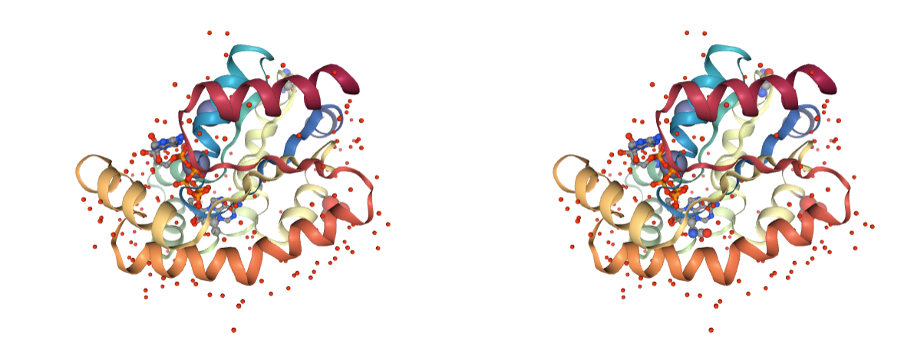</img>

<a id="ss"></a>
##  Disulfide Bridges
Presence of **disulfide bridges** (-S-S- bonds) based on distance criteria. **Disulfide bonds** are crucial for the **structure stability**, and MD simulations require those bonds to be correctly set. Most of the **MD packages** come with tools able to automatically identify -S-S- bonds and include them in the **system topology** parameters, but some of them need the residues involved in the bond to be **explicitly marked** (e.g. AMBER CYX residues). 
***
Use **BioBB fix_ss_bonds** to mark the **disulfide bridges**. 

 - [fix_ssbonds](https://biobb-model.readthedocs.io/en/latest/model.html#module-model.fix_ssbonds) from **biobb_model.model.fix_ssbonds**
***


```python
print(json.dumps(data['getss'], indent=2))
```

    {}


```python
from biobb_model.model.fix_ssbonds import fix_ssbonds

pdb_ssbonds = pdbCode + ".ssbonds.pdb"

fix_ssbonds(
    input_pdb_path=pdb_altloc,
    output_pdb_path=pdb_ssbonds
)
```


```python
# Show modified structure
view1 = nglview.show_structure_file(pdb_altloc)
view1.add_representation(repr_type='spacefill', selection='ion')
view1.add_representation(repr_type='spacefill', radius='0.3', selection='water')
view1.add_representation(repr_type='ball+stick', radius='0.4', selection='CYS')
view1._remote_call('setSize', target='Widget', args=['','450px'])
view2 = nglview.show_structure_file(pdb_ssbonds)
view2.add_representation(repr_type='spacefill', selection='ion')
view2.add_representation(repr_type='spacefill', radius='0.3', selection='water')
view2.add_representation(repr_type='ball+stick', radius='0.2', selection='CYS')
view2.add_representation(repr_type='ball+stick', radius='0.4', selection='CYX')
view2._remote_call('setSize', target='Widget', args=['','450px'])
ipywidgets.HBox([view1, view2])
```

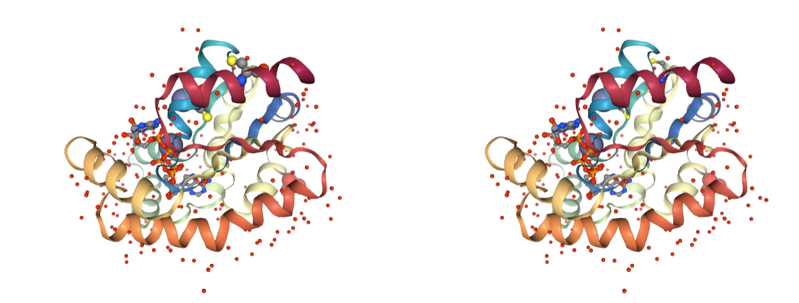</img>

<a id="metals"></a>
##  Metal Ions
Presence of heteroatoms being **metal ions**. Only structural **metal ions** should be kept in MD simulations, as they require special **force field parameters**. In some cases, the **atomic coordination** between the **protein atoms** and the **metal ions** should be also specified. 
***
Use **BioBB remove_molecules** to remove the undesired **metal ions**. 

 - [remove_molecules](https://biobb-structure-utils.readthedocs.io/en/latest/utils.html#module-utils.remove_molecules) from **biobb_structure-utils.utils.remove_molecules**
***


```python
print(json.dumps(data['metals'], indent=2))
```

    {
      "detected": [
        " ZN A601",
        " ZN A641",
        " ZN B611",
        " ZN B642",
        " ZN B643",
        " ZN C621",
        " ZN C644",
        " ZN C645"
      ]
    }


```python
from biobb_structure_utils.utils.remove_molecules import remove_molecules

pdb_metals = pdbCode + ".metals.pdb"

prop = {
    'molecules': [
        {
            'name': 'ZN'
        }
    ]
}
remove_molecules(input_structure_path=pdb_ssbonds,
                 output_molecules_path=pdb_metals,
                 properties=prop)

```


```python
# Show modified structure
view1 = nglview.show_structure_file(pdb_chains)
view1.add_representation(repr_type='spacefill', selection='ion')
view1.add_representation(repr_type='spacefill', radius='0.3', selection='water')
view1.add_representation(repr_type='ball+stick', radius='0.4', selection='CYS')
view1._remote_call('setSize', target='Widget', args=['','450px'])
view2 = nglview.show_structure_file(pdb_metals)
view2.add_representation(repr_type='spacefill', selection='ion')
view2.add_representation(repr_type='spacefill', radius='0.3', selection='water')
view2.add_representation(repr_type='ball+stick', radius='0.2', selection='CYS')
view2.add_representation(repr_type='ball+stick', radius='0.4', selection='CYX')
view2._remote_call('setSize', target='Widget', args=['','450px'])
ipywidgets.HBox([view1, view2])
```

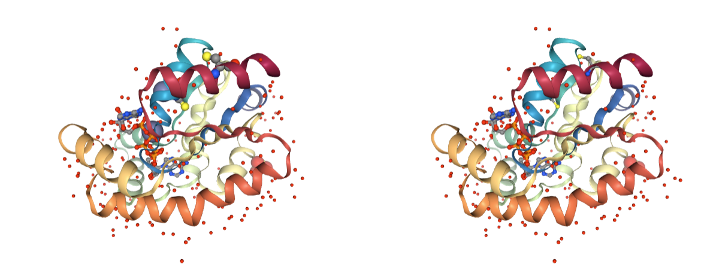</img>

<a id="ligands"></a>
##  Ligands
Presence of heteroatoms being **ligands**. Only important **ligands** should be kept in MD simulations, as they require special **force field parameters**. 
***
Use **BioBB remove_molecules** to remove the undesired **ligands**. 

 - [remove_molecules](https://biobb-structure-utils.readthedocs.io/en/latest/utils.html#module-utils.remove_molecules) from **biobb_structure-utils.utils.remove_molecules**
***


```python
print(json.dumps(data['ligands'], indent=2))
```

    {
      "detected": [
        " ZN A601",
        " ZN A641",
        "SO4 A702",
        "AP5 A631",
        " ZN B611",
        " ZN B642",
        " ZN B643",
        "SO4 B701",
        "SO4 B703",
        "AP5 B632",
        " ZN C621",
        " ZN C644",
        " ZN C645",
        "AP5 C633"
      ]
    }


```python
from biobb_structure_utils.utils.remove_molecules import remove_molecules

pdb_ligands = pdbCode + ".ligands.pdb"

prop = {
    'molecules': [
        {
            'name': 'SO4',
        },
        {
            'name' : 'AP5'
        }
    ]
}
remove_molecules(input_structure_path=pdb_metals,
                 output_molecules_path=pdb_ligands,
                 properties=prop)

```


```python
# Show modified structure
view1 = nglview.show_structure_file(pdb_metals)
view1.add_representation(repr_type='spacefill', selection='ion')
view1.add_representation(repr_type='spacefill', radius='0.3', selection='water')
view1._remote_call('setSize', target='Widget', args=['','450px'])
view2 = nglview.show_structure_file(pdb_ligands)
view2.add_representation(repr_type='spacefill', selection='ion')
view2.add_representation(repr_type='spacefill', radius='0.3', selection='water')
view2._remote_call('setSize', target='Widget', args=['','450px'])
ipywidgets.HBox([view1, view2])
```

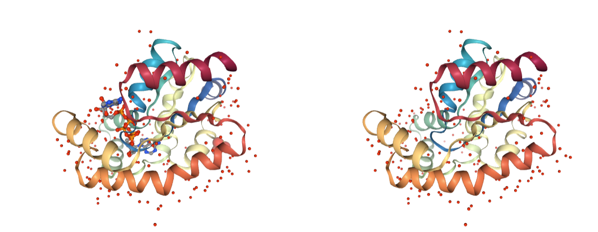</img>

<a id="hydrogens"></a>
##  Hydrogen atoms
Presence of **hydrogen atoms**. MD setup can be done with the original **hydrogen atoms**, however to prevent possible problems coming from non **standard labelling**, removing them is safer. 
***
Use **BioBB reduce_remove_hydrogens** to remove the undesired **hydrogen atoms**. 

 - [reduce_remove_hydrogens](https://biobb-chemistry.readthedocs.io/en/latest/ambertools.html#module-ambertools.reduce_remove_hydrogens) from **biobb_chemistry.ambertools.reduce_remove_hydrogens**
***


```python
print(json.dumps(data['stats']['stats'], indent=2))
```

    {
      "num_ats": 5123,
      "num_h": 0,
      "num_res": 1057,
      "num_wat": 458,
      "res_h": 0,
      "res_hetats": 472,
      "res_insc": 0,
      "res_ligands": 14
    }


```python
from biobb_chemistry.ambertools.reduce_remove_hydrogens import reduce_remove_hydrogens

pdb_hydrogens = pdbCode + ".hydrogens.pdb"

reduce_remove_hydrogens(
    input_path=pdb_ligands,
    output_path=pdb_hydrogens
)
```


```python
# Show modified structure
view1 = nglview.show_structure_file(pdb_ligands)
view1.add_representation(repr_type='spacefill', selection='ion')
view1.add_representation(repr_type='spacefill', radius='0.3', selection='water')
view1.add_representation(repr_type='spacefill', selection='hydrogen')
view1._remote_call('setSize', target='Widget', args=['','450px'])
view2 = nglview.show_structure_file(pdb_hydrogens)
view2.add_representation(repr_type='spacefill', selection='ion')
view2.add_representation(repr_type='spacefill', radius='0.3', selection='water')
view2.add_representation(repr_type='spacefill', selection='hydrogen')
view2._remote_call('setSize', target='Widget', args=['','450px'])
ipywidgets.HBox([view1, view2])
```

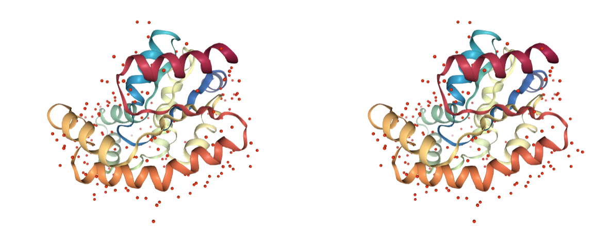</img>

<a id="water"></a>
##  Water molecules
Presence of **water molecules**. **Crystallographic water molecules** may be relevant for keeping the structure stable, however in most cases only some of them are required. These can be later added using other methods.
***
Use **BioBB remove_pdb_water** to remove the undesired **water molecules**. 

 - [remove_pdb_water](https://biobb-structure-utils.readthedocs.io/en/latest/utils.html#module-utils.remove_pdb_water) from **biobb_structure-utils.utils.remove_pdb_water**
***


```python
print(json.dumps(data['stats']['stats'], indent=2))
```

    {
      "num_ats": 5123,
      "num_h": 0,
      "num_res": 1057,
      "num_wat": 458,
      "res_h": 0,
      "res_hetats": 472,
      "res_insc": 0,
      "res_ligands": 14
    }


```python
from biobb_structure_utils.utils.remove_pdb_water import remove_pdb_water

pdb_water = pdbCode + ".water.pdb"

remove_pdb_water(
    input_pdb_path=pdb_hydrogens,
    output_pdb_path=pdb_water
)
```


```python
# Show modified structure
view1 = nglview.show_structure_file(pdb_hydrogens)
view1.add_representation(repr_type='spacefill', selection='ion')
view1.add_representation(repr_type='spacefill', radius='0.5', selection='water')
view1._remote_call('setSize', target='Widget', args=['','450px'])
view2 = nglview.show_structure_file(pdb_water)
view2.add_representation(repr_type='spacefill', selection='ion')
view2.add_representation(repr_type='spacefill', radius='0.5', selection='water')
view2._remote_call('setSize', target='Widget', args=['','450px'])
ipywidgets.HBox([view1, view2])
```

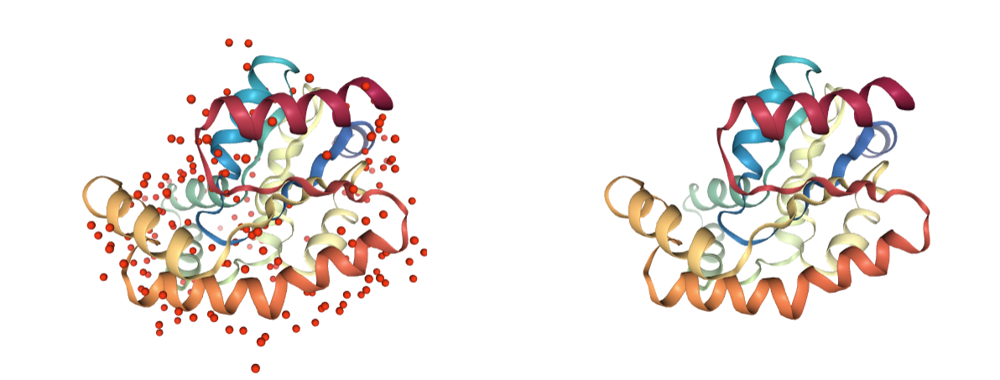</img>

<a id="amide"></a>
##  Amide groups
Presence of incorrect **amide groups**. **Amide terminal atoms** in ***Asparagines*** and ***Glutamines*** residues can be labelled incorrectly, with swapped **Nitrogen** and **Oxygen** atoms from the **amide group**. 
***
Use **BioBB fix_amides** to fix the incorrectly assigned **amide groups**. 

 - [fix_amides](https://biobb-model.readthedocs.io/en/latest/model.html#module-model.fix_amides) from **biobb_model.model.fix_amides**
***


```python
print(json.dumps(data['amide'], indent=2))
```

    {
      "n_amides": 36
    }


```python
from biobb_model.model.fix_amides import fix_amides

pdb_amides = pdbCode + ".amides.pdb"

fix_amides(
    input_pdb_path=pdb_water,
    output_pdb_path=pdb_amides
)
```


```python
# Show modified structure
view1 = nglview.show_structure_file(pdb_water)
view1.add_representation(repr_type='spacefill', selection='ion')
view1.add_representation(repr_type='spacefill', radius='0.3', selection='water')
view1.add_representation(repr_type='ball+stick', radius='0.4', selection='amide')
view1._remote_call('setSize', target='Widget', args=['','450px'])
view2 = nglview.show_structure_file(pdb_amides)
view2.add_representation(repr_type='spacefill', selection='ion')
view2.add_representation(repr_type='spacefill', radius='0.3', selection='water')
view2.add_representation(repr_type='ball+stick', radius='0.4', selection='amide')
view2._remote_call('setSize', target='Widget', args=['','450px'])
ipywidgets.HBox([view1, view2])
```

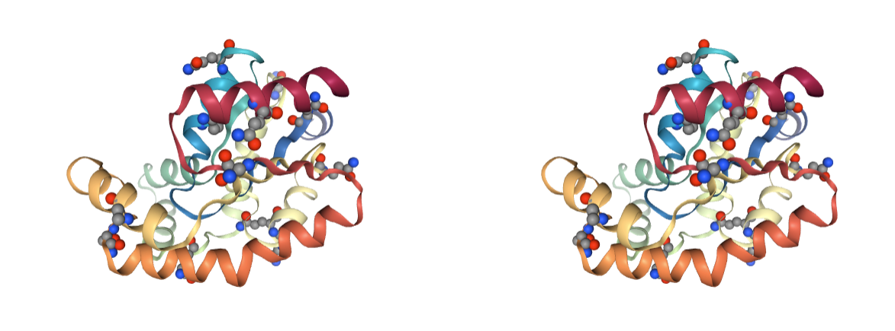</img>

<a id="chirality"></a>
##  Chirality
Presence of incorrect **chiralities**. Side chains of ***Threonine*** and ***Isoleucine*** residues are **chiral**. <br> **Incorrect atom labelling** can lead to the **wrong chirality**. 
***
Use **BioBB fix_chirality** to fix the incorrectly assigned **chirality**. 

 - [fix_chirality](https://biobb-model.readthedocs.io/en/latest/model.html#module-model.fix_chirality) from **biobb_model.model.fix_chirality**
***


```python
print(json.dumps(data['chiral'], indent=2))
```

    {
      "n_chirals": 69
    }


```python
from biobb_model.model.fix_chirality import fix_chirality

pdb_chiral = pdbCode + ".chiral.pdb"

fix_chirality(
    input_pdb_path=pdb_amides,
    output_pdb_path=pdb_chiral
)
```


```python
# Show modified structure
view1 = nglview.show_structure_file(pdb_amides)
view1.add_representation(repr_type='spacefill', selection='ion')
view1.add_representation(repr_type='spacefill', radius='0.3', selection='water')
view1._remote_call('setSize', target='Widget', args=['','450px'])
view2 = nglview.show_structure_file(pdb_chiral)
view2.add_representation(repr_type='spacefill', selection='ion')
view2.add_representation(repr_type='spacefill', radius='0.3', selection='water')
view2._remote_call('setSize', target='Widget', args=['','450px'])
ipywidgets.HBox([view1, view2])
```

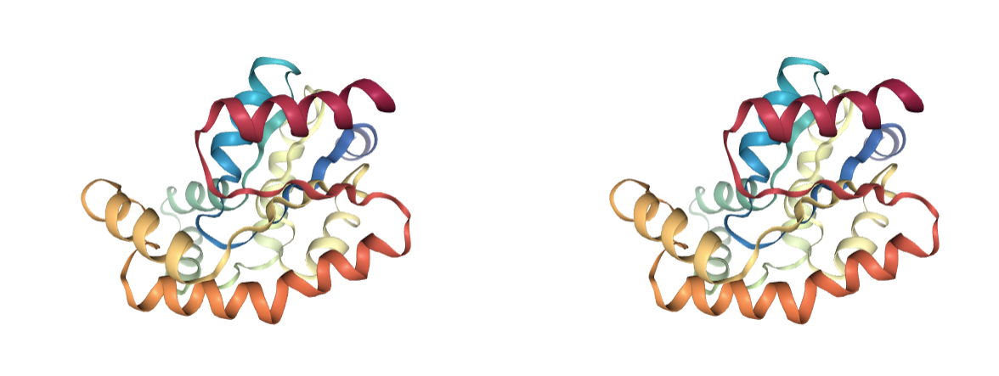</img>

<a id="sidechains"></a>
##  Side Chains
Presence of **missing protein side chain atoms**. MD programs only work with complete residues; some of the MD packages come with tools able to **model missing side chain atoms**, but not all of them. 
***
Use **BioBB fix_side_chain** to model the **missing side chain atoms**. 

 - [fix_side_chain](https://biobb-model.readthedocs.io/en/latest/model.html#module-model.fix_side_chain) from **biobb_model.model.fix_side_chain**
***


```python
print(json.dumps(data['fixside'], indent=2))
```

    {
      "detected_missing": {
        "ARG C53": [
          "CD",
          "NE",
          "CZ",
          "NH1",
          "NH2"
        ],
        "GLN A127": [
          "CD",
          "OE1",
          "NE2"
        ],
        "GLN B100": [
          "CG",
          "CD",
          "OE1",
          "NE2"
        ],
        "GLN B127": [
          "CD",
          "OE1",
          "NE2"
        ],
        "GLN C127": [
          "CD",
          "OE1",
          "NE2"
        ],
        "GLU A123": [
          "CD",
          "OE1",
          "OE2"
        ],
        "GLU A143": [
          "CD",
          "OE1",
          "OE2"
        ],
        "GLU B123": [
          "CG",
          "CD",
          "OE1",
          "OE2"
        ],
        "GLU B151": [
          "CD",
          "OE1",
          "OE2"
        ],
        "GLU B3": [
          "OE1",
          "OE2"
        ],
        "GLU C123": [
          "CD",
          "OE1",
          "OE2"
        ],
        "GLU C134": [
          "CD",
          "OE1",
          "OE2"
        ],
        "GLU C2": [
          "CD",
          "OE1",
          "OE2"
        ],
        "GLU C59": [
          "CD",
          "OE1",
          "OE2"
        ],
        "LEU B193": [
          "CD1",
          "CD2"
        ],
        "LEU C193": [
          "CG",
          "CD1",
          "CD2"
        ],
        "LYS A155": [
          "CE",
          "NZ"
        ],
        "LYS A56": [
          "CD",
          "CE",
          "NZ"
        ],
        "LYS A63": [
          "CD",
          "CE",
          "NZ"
        ],
        "LYS A7": [
          "CE",
          "NZ"
        ],
        "LYS B131": [
          "CD",
          "CE",
          "NZ"
        ],
        "LYS B155": [
          "CE",
          "NZ"
        ],
        "LYS B166": [
          "CE",
          "NZ"
        ],
        "LYS B55": [
          "CD",
          "CE",
          "NZ"
        ],
        "LYS B56": [
          "CD",
          "CE",
          "NZ"
        ],
        "LYS B7": [
          "CD",
          "CE",
          "NZ"
        ],
        "LYS C131": [
          "CD",
          "CE",
          "NZ"
        ],
        "LYS C55": [
          "CE",
          "NZ"
        ],
        "LYS C56": [
          "CE",
          "NZ"
        ],
        "LYS C7": [
          "CE",
          "NZ"
        ],
        "LYS C83": [
          "CE",
          "NZ"
        ],
        "LYS C88": [
          "CE",
          "NZ"
        ]
      }
    }


```python
from biobb_model.model.fix_side_chain import fix_side_chain

pdb_side_chains = pdbCode + ".sidechains.pdb"

fix_side_chain(
    input_pdb_path=pdb_chiral,
    output_pdb_path=pdb_side_chains
)
```


```python
# Show modified structure
view1 = nglview.show_structure_file(pdb_chiral)
view1.add_representation(repr_type='spacefill', selection='ion')
view1.add_representation(repr_type='spacefill', radius='0.3', selection='water')
view1.add_representation(repr_type='ball+stick', radius='0.4', selection='7 56 63 123 127 143 155')
view1._remote_call('setSize', target='Widget', args=['','450px'])
view2 = nglview.show_structure_file(pdb_side_chains)
view2.add_representation(repr_type='spacefill', selection='ion')
view2.add_representation(repr_type='spacefill', radius='0.3', selection='water')
view2.add_representation(repr_type='ball+stick', radius='0.4', selection='7 56 63 123 127 143 155')
view2._remote_call('setSize', target='Widget', args=['','450px'])
ipywidgets.HBox([view1, view2])
```

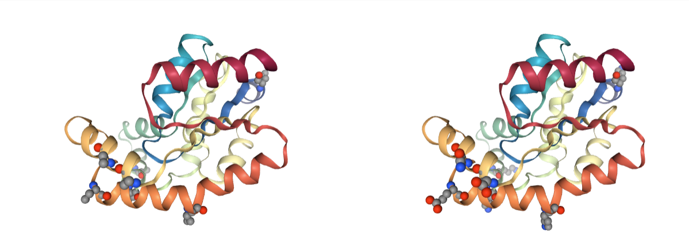</img>

<a id="backbone"></a>
##  Backbone
Presence of **missing backbone atoms**. **PDB files** can have **missing backbone atoms**, usually placed in **flexible regions** of the molecule. **MD programs** work with amino acid libraries that need all atoms to be present. Some MD packages tools are able to model **side chain missing atoms**, but they are rarely capable of modeling **backbone atoms**. 
***
Use **BioBB fix_backbone** to model the **missing backbone atoms**. <br>

 - [fix_backbone](https://biobb-model.readthedocs.io/en/latest/model.html#module-model.fix_backbone) from **biobb_model.model.fix_backbone**

***NOTE:*** This building block uses [Modeller](https://salilab.org/modeller) to rebuilt **missing backbone atoms**. **Modeller** requires a **license** that can be easily obtained in the [Modeller registration page](https://salilab.org/modeller/registration.html). This **license** in form of a **keyword** needs to be written in a specific file in order for **Modeller** to work. This file is shown in the next cell. Alternatively, the keyword can be inserted using the **modeller_key** property of the **building block**.
 
An additional **building block** is used to extract the **canonical FASTA sequence** for the protein, to be used in **Modeler** to model the **missing backbone region**:

 - [canonical_fasta](https://biobb-io.readthedocs.io/en/latest/api.html#module-api.canonical_fasta) from **biobb_io.api.canonical_fasta**

***


```python
print(json.dumps(data['backbone'], indent=2))
```

    {
      "missing_atoms": {
        "LEU A194": [
          "OXT"
        ],
        "LEU B194": [
          "OXT"
        ],
        "LEU C194": [
          "OXT"
        ]
      }
    }


```python
from biobb_io.api.canonical_fasta import canonical_fasta

pdb_fasta = pdbCode + ".fasta"

prop = {
    'pdb_code': pdbCode,
    'api_id': 'pdb'
}

canonical_fasta(
    output_fasta_path=pdb_fasta,
    properties=prop
)
```


```python
# Add Modeller key in the config file before running the next cell
# Alternatively, add the Modeller key in the "modeller_key" property of the fix_backbone building block
import os
conda_env_path = os.environ['CONDA_PREFIX']
modeller_key_path = conda_env_path + "/lib/modeller-10.3/modlib/modeller/config.py"
print("WARNING: Edit this file and add your Modeller KEY:\n " + modeller_key_path)
```


```python
from biobb_model.model.fix_backbone import fix_backbone

pdb_backbone = pdbCode + ".backbone.pdb"

prop = {
    
}

fix_backbone(
    input_pdb_path=pdb_side_chains,
    input_fasta_canonical_sequence_path=pdb_fasta,
    output_pdb_path=pdb_backbone,
    properties=prop
)
```


```python
# Show modified structure
view1 = nglview.show_structure_file(pdb_side_chains)
view1.add_representation(repr_type='spacefill', selection='ion')
view1.add_representation(repr_type='spacefill', radius='0.3', selection='water')
view1._remote_call('setSize', target='Widget', args=['','450px'])
view2 = nglview.show_structure_file(pdb_backbone)
view2.add_representation(repr_type='spacefill', selection='ion')
view2.add_representation(repr_type='spacefill', radius='0.3', selection='water')
view2._remote_call('setSize', target='Widget', args=['','450px'])
ipywidgets.HBox([view1, view2])
```

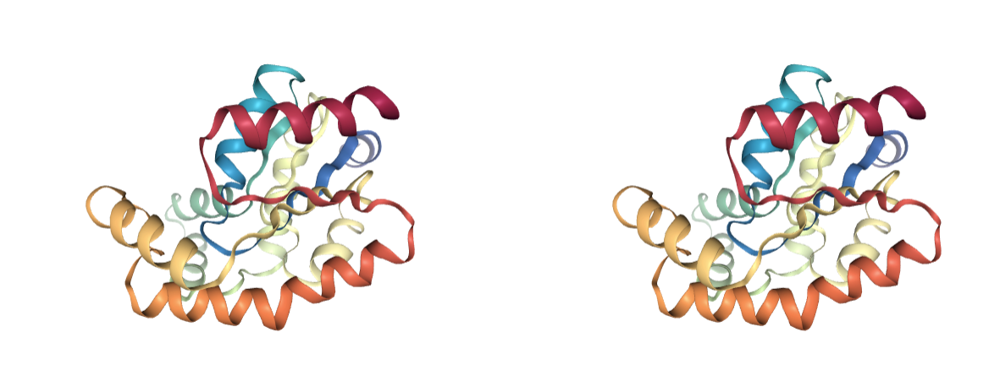</img>

<a id="clashes"></a>
##  Atomic Clashes
Presence of **atomic clashes**. Atoms that are **too close in space** can have a problem of **energetic repulsion**. Most clashes come from **over-compactation** of crystal structures and are naturally corrected on **system setup** or **MD equilibration**, but may lead to a significant **distortion** of the structure. **Clashes** are detected based on **distance criteria** and are classified in different groups, depending on the **atom types** involved:

- **Severe**: Atoms too close, usually indicating superimposed structures or badly modelled regions. Should be fixed.
- **Apolar**: Vdw collisions. Usually fixed during the simulation.
- **Polar and ionic**: Usually indicate wrong side chain conformations. Usually fixed during the simulation

***
Use the **BioBB_amber** module to energetically minimize the structure and fix **atomic clashes**.

 - [leap_gen_top](https://biobb-amber.readthedocs.io/en/latest/leap.html#module-leap.leap_gen_top) from **biobb_amber.leap.leap_gen_top**
 - [sander_mdrun](https://biobb-amber.readthedocs.io/en/latest/sander.html#module-sander.sander_mdrun) from **biobb_amber.sander.sander_mdrun**
 - [amber_to_pdb](https://biobb-amber.readthedocs.io/en/latest/ambpdb.html#module-ambpdb.amber_to_pdb) from **biobb_amber.ambpdb.amber_to_pdb**

***


```python
print(json.dumps(data['clashes'], indent=2))
```

    {
      "detected": {
        "apolar": [
          {
            "at1": "GLU A46.OE1",
            "at2": "MET A75.CE",
            "dist": 2.651
          },
          {
            "at1": "ARG A53.O",
            "at2": "LYS A56.CG",
            "dist": 2.7251
          },
          {
            "at1": "GLU A123.O",
            "at2": "GLN A127.CG",
            "dist": 2.8177
          },
          {
            "at1": "GLU B70.CD",
            "at2": " ZN B642.ZN",
            "dist": 2.893
          },
          {
            "at1": "ASP C74.CG",
            "at2": " ZN C645.ZN",
            "dist": 2.7006
          }
        ],
        "negative": [
          {
            "at1": "GLU A70.OE2",
            "at2": "ASP A74.OD2",
            "dist": 3.3062
          },
          {
            "at1": "GLU A70.OE2",
            "at2": "GLU B70.OE1",
            "dist": 3.4246
          },
          {
            "at1": "GLU A70.OE2",
            "at2": "GLU B104.OE1",
            "dist": 3.4053
          },
          {
            "at1": "ASP A74.OD1",
            "at2": "GLU B70.OE2",
            "dist": 3.1557
          },
          {
            "at1": "ASP A74.OD2",
            "at2": "GLU B104.OE1",
            "dist": 3.0494
          },
          {
            "at1": "GLU C70.OE2",
            "at2": "ASP C74.OD1",
            "dist": 3.2633
          }
        ],
        "polar_acceptor": [
          {
            "at1": "GLU A2.OE2",
            "at2": "ILE A109.O",
            "dist": 2.5821
          },
          {
            "at1": "SER A58.O",
            "at2": "GLU A62.OE2",
            "dist": 2.9717
          },
          {
            "at1": "ASP A74.OD2",
            "at2": "GLU B104.OE1",
            "dist": 3.0494
          }
        ],
        "polar_donor": [],
        "positive": [
          {
            "at1": "ARG A44.NH1",
            "at2": "ARG A138.NH1",
            "dist": 3.4254
          },
          {
            "at1": "ARG A132.NH2",
            "at2": "ARG A138.NE",
            "dist": 3.3889
          },
          {
            "at1": "LYS B6.NZ",
            "at2": "ARG C171.NH2",
            "dist": 3.439
          },
          {
            "at1": "ARG B44.NH1",
            "at2": "ARG B138.NH1",
            "dist": 3.2688
          },
          {
            "at1": "ARG B138.NH2",
            "at2": "ARG B149.NH2",
            "dist": 3.3051
          },
          {
            "at1": "ARG C44.NH1",
            "at2": "ARG C138.NH1",
            "dist": 3.3648
          },
          {
            "at1": "ARG C132.NH2",
            "at2": "ARG C138.NH1",
            "dist": 3.3057
          },
          {
            "at1": "ARG C138.NH2",
            "at2": "ARG C149.NH2",
            "dist": 3.3646
          }
        ],
        "severe": []
      }
    }


```python
from biobb_amber.leap.leap_gen_top import leap_gen_top

pdb_amber = pdbCode + ".amber.pdb"
top_amber = pdbCode + ".amber.top"
crd_amber = pdbCode + ".amber.crd"

prop = {
    'forcefield': ['protein.ff14SB']
}

leap_gen_top(
    input_pdb_path=pdb_backbone,
    output_pdb_path=pdb_amber,
    output_top_path=top_amber,
    output_crd_path=crd_amber,
    properties=prop
)
```


```python
from biobb_amber.sander.sander_mdrun import sander_mdrun

trj_amber = pdbCode + ".amber.crd"
rst_amber = pdbCode + ".amber.rst"
log_amber = pdbCode + ".amber.log"

prop = {
    'simulation_type' : 'minimization',
    'mdin' : {
        'ntb' : 0,        # Periodic Boundary. No periodicity is applied and PME (Particle Mesh Ewald) is off.
        'cut' : 12,       # Nonbonded cutoff, in Angstroms.
        'maxcyc' : 500,   # Maximum number of cycles of minimization.
        'ncyc' : 50       # Minimization will be switched from steepest descent to conjugate gradient after ncyc cycles.
    }
}

sander_mdrun(
     input_top_path=top_amber,
     input_crd_path=crd_amber,
     output_traj_path=trj_amber,
     output_rst_path=rst_amber,
     output_log_path=log_amber,
     properties=prop
)
```


```python
from biobb_amber.ambpdb.amber_to_pdb import amber_to_pdb

pdb_amber_min = pdbCode + ".amber-min.pdb"

amber_to_pdb(
      input_top_path=top_amber,
      input_crd_path=rst_amber,
      output_pdb_path=pdb_amber_min
)
```


```python
# Show modified structure
view1 = nglview.show_structure_file(pdb_backbone)
view1.add_representation(repr_type='ball+stick', selection='all')
view1.add_representation(repr_type='spacefill', selection='ion')
view1.add_representation(repr_type='spacefill', radius='0.3', selection='water')
view1._remote_call('setSize', target='Widget', args=['','450px'])
view2 = nglview.show_structure_file(pdb_amber_min)
view2.clear_representations()
view2.add_representation(repr_type='cartoon', selection='all')
view2.add_representation(repr_type='ball+stick', selection='all')
view2.add_representation(repr_type='spacefill', selection='ion')
view2.add_representation(repr_type='spacefill', radius='0.3', selection='water')
view2._remote_call('setSize', target='Widget', args=['','450px'])
ipywidgets.HBox([view1, view2])
```

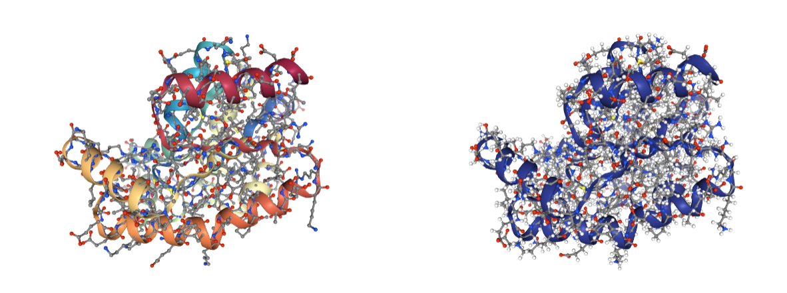</img>

<a id="fix_pdb"></a>
##  Fix PDB

Information included in the **original structure** is sometimes **lost** during the **preparation process**. Typical examples are the **residue numeration** and the **structure chains**, that are **changed** or even **removed** by some **MD tools** (as happened with the chains in the previous **energy minimization** process). The **fix_pdb** building block renumerates the residues in a **PDB structure** according to reference **sequences from UniProt** and assigns **chain ids** accordingly.
***
Use the **BioBB_model** module to ***fix*** the structure, **renumerating** the residues and assigning **chain ids**.

 - [fix_pdb](https://biobb-model.readthedocs.io/en/latest/fix_pdb.html#module-model.fix_pdb) from **biobb_model.model.fix_pdb**

***


```python
from biobb_model.model.fix_pdb import fix_pdb

final_pdb = pdbCode + ".final.pdb"

fix_pdb(
    input_pdb_path=pdb_amber_min,
    output_pdb_path=final_pdb
)
```

<a id="finalcheck"></a>
##  Final Check
Checking the **final structure** to analyse the **possible issues** present in the **modified structure** in comparison with the issues we found with the **original structure** at the beginning of the workflow. 
***
**Building Blocks** used:
 - [structure_check](https://biobb-structure-utils.readthedocs.io/en/latest/utils.html#module-utils.structure_check) from **biobb_structure_utils.utils.structure_check**
***


```python
from biobb_structure_utils.utils.structure_check import structure_check

report_final = pdbCode + ".report_final.json"

structure_check(
    input_structure_path=final_pdb,
    output_summary_path=report_final
)
```


```python
import json
with open(report_final, 'r') as f:
  data_final = json.load(f)
print(json.dumps(data_final, indent=2))
```

    {
      "FASTA": {
        "canonical": "",
        "structure": ">pdb_sq_A Frags: 1-195\nSMEEKLKKTNIIFVVGGPGSGKGTQCEKIVQKYGYTHLSTGDLLRSEVSSGSARGKKLSE\nIMEKGQLVPLETVLDMLRDAMVAKVNTSKGFLIDGYPREVQQGEEFERRIGQPTLLLYVD\nAGPETMTQRLLKRGETSGRVDDNEETIKKRLETYYKATEPVIAFYEKRGIVRKVNAEGSV\nDSVFSQVCTHLDALL\n"
      },
      "add_hydrogen": {
        "ionic_detected": [
          "GLU A3",
          "GLU A4",
          "LYS A5",
          "LYS A7",
          "LYS A8",
          "LYS A22",
          "CYS A26",
          "GLU A27",
          "LYS A28",
          "LYS A32",
          "TYR A33",
          "TYR A35",
          "ASP A42",
          "ARG A45",
          "GLU A47",
          "ARG A54",
          "LYS A56",
          "LYS A57",
          "GLU A60",
          "GLU A63",
          "LYS A64",
          "GLU A71",
          "ASP A75",
          "ARG A78",
          "ASP A79",
          "LYS A84",
          "LYS A89",
          "ASP A94",
          "TYR A96",
          "ARG A98",
          "GLU A99",
          "GLU A104",
          "GLU A105",
          "GLU A107",
          "ARG A108",
          "ARG A109",
          "TYR A118",
          "ASP A120",
          "GLU A124",
          "ARG A129",
          "LYS A132",
          "ARG A133",
          "GLU A135",
          "ARG A139",
          "ASP A141",
          "ASP A142",
          "GLU A144",
          "GLU A145",
          "LYS A148",
          "LYS A149",
          "ARG A150",
          "GLU A152",
          "TYR A154",
          "TYR A155",
          "LYS A156",
          "GLU A159",
          "TYR A165",
          "GLU A166",
          "LYS A167",
          "ARG A168",
          "ARG A172",
          "LYS A173",
          "GLU A177",
          "ASP A181",
          "CYS A188",
          "ASP A192"
        ]
      },
      "altloc": {},
      "amide": {
        "n_amides": 12
      },
      "backbone": {},
      "chains": {
        "A": "Protein/0",
        "unlabelled": false
      },
      "chiral": {
        "n_chirals": 23
      },
      "chiral_bck": {
        "n_chirals": 176
      },
      "cistransbck": {
        "cis": [
          [
            "TYR A96",
            "PRO A97",
            -10.786
          ]
        ]
      },
      "clashes": {
        "detected": {
          "apolar": [],
          "negative": [],
          "polar_acceptor": [],
          "polar_donor": [],
          "positive": [
            {
              "at1": "ARG A45.NH2",
              "at2": "ARG A139.NH1",
              "dist": 3.3053
            },
            {
              "at1": "ARG A133.NH2",
              "at2": "ARG A139.NE",
              "dist": 3.1559
            }
          ],
          "severe": []
        }
      },
      "fixside": {},
      "getss": {},
      "headers": {
        "entry_id": "",
        "method": "unknown",
        "resolution": "N.A.",
        "title": ""
      },
      "inscodes": {},
      "ligands": {},
      "loaded_structure": "/Users/gbayarri/projects/BioBB/tutorials/biobb_wf_structure_checking/biobb_wf_structure_checking/notebooks/5360fe24-7e9a-4261-928a-04522e8646ba/1z83.final.pdb",
      "metals": {},
      "models": {
        "nmodels": 1
      },
      "rem_hydrogen": {
        "n_detected": 195
      },
      "sequences": {},
      "stats": {
        "biounit": false,
        "ca_only": false,
        "chain_guess_details": [
          {
            "A": {
              "DNA": 0.0,
              "Other": 0.01025641025641022,
              "Protein": 0.9897435897435898,
              "RNA": 0.0
            }
          }
        ],
        "chain_ids": [
          {
            "A": "Protein"
          }
        ],
        "models_type": 0,
        "nchains": [
          1
        ],
        "nmodels": 1,
        "stats": {
          "num_ats": 3078,
          "num_h": 1557,
          "num_res": 195,
          "num_wat": 0,
          "res_h": 195,
          "res_hetats": 0,
          "res_insc": 0,
          "res_ligands": 0
        },
        "total_charge": null
      },
      "water": {}
    }


Printing the possible **issues** identified by the **structure_check** building block in the **original structure** (left column) against the **checked structure** (right column). The main differences are the elimination of the **alternative locations**, **metal ions** and **ligands**. Most of the **clashes** have also disappeared thanks to the **short energetic minimization**.  

The **structure** should be now ready to start the **MD setup process**.


```python
from ipywidgets import Layout

output1 = ipywidgets.widgets.Output(layout=Layout(width='50%'))
with output1:
    display(print(json.dumps(data, indent=2)))
output2 = ipywidgets.widgets.Output(layout=Layout(width='50%'))
with output2:
    display(print(json.dumps(data_final, indent=2)))

two_columns = ipywidgets.widgets.HBox([output1, output2])

display(two_columns)
```


<div style="width: 50%; float:left;">
    <pre>{
      "FASTA": {
        "canonical": "",
        "structure": ">pdb_sq_A Frags: 0-194\nSMEEKLKKTNIIFVVGGPGSGKGTQCEKIVQKYGYTHLSTGDLLRSEVSSGSARGKKLSE\nIMEKGQLVPLETVLDMLRDAMVAKVNTSKGFLIDGYPREVQQGEEFERRIGQPTLLLYVD\nAGPETMTQRLLKRGETSGRVDDNEETIKKRLETYYKATEPVIAFYEKRGIVRKVNAEGSV\nDSVFSQVCTHLDALL\n>pdb_sq_B Frags: 0-194\nSMEEKLKKTNIIFVVGGPGSGKGTQCEKIVQKYGYTHLSTGDLLRSEVSSGSARGKKLSE\nIMEKGQLVPLETVLDMLRDAMVAKVNTSKGFLIDGYPREVQQGEEFERRIGQPTLLLYVD\nAGPETMTQRLLKRGETSGRVDDNEETIKKRLETYYKATEPVIAFYEKRGIVRKVNAEGSV\nDSVFSQVCTHLDALL\n>pdb_sq_C Frags: 0-194\nSMEEKLKKTNIIFVVGGPGSGKGTQCEKIVQKYGYTHLSTGDLLRSEVSSGSARGKKLSE\nIMEKGQLVPLETVLDMLRDAMVAKVNTSKGFLIDGYPREVQQGEEFERRIGQPTLLLYVD\nAGPETMTQRLLKRGETSGRVDDNEETIKKRLETYYKATEPVIAFYEKRGIVRKVNAEGSV\nDSVFSQVCTHLDALL\n"
      },
      "add_hydrogen": {
        "ionic_detected": [
          "GLU A2",
          "GLU A3",
          "LYS A4",
          "LYS A6",
          "LYS A7",
          "LYS A21",
          "CYS A25",
          "GLU A26",
          "LYS A27",
          "LYS A31",
          "TYR A32",
          "TYR A34",
          "HIS A36",
          "ASP A41",
          "ARG A44",
          "GLU A46",
          "ARG A53",
          "LYS A55",
          "LYS A56",
          "GLU A59",
          "GLU A62",
          "LYS A63",
          "GLU A70",
          "ASP A74",
          "ARG A77",
          "ASP A78",
          "LYS A83",
          "LYS A88",
          "ASP A93",
          "TYR A95",
          "ARG A97",
          "GLU A98",
          "GLU A103",
          "GLU A104",
          "GLU A106",
          "ARG A107",
          "ARG A108",
          "TYR A117",
          "ASP A119",
          "GLU A123",
          "ARG A128",
          "LYS A131",
          "ARG A132",
          "GLU A134",
          "ARG A138",
          "ASP A140",
          "ASP A141",
          "GLU A143",
          "GLU A144",
          "LYS A147",
          "LYS A148",
          "ARG A149",
          "GLU A151",
          "TYR A153",
          "TYR A154",
          "LYS A155",
          "GLU A158",
          "TYR A164",
          "GLU A165",
          "LYS A166",
          "ARG A167",
          "ARG A171",
          "LYS A172",
          "GLU A176",
          "ASP A180",
          "CYS A187",
          "HIS A189",
          "ASP A191",
          "GLU B2",
          "GLU B3",
          "LYS B4",
          "LYS B6",
          "LYS B7",
          "LYS B21",
          "CYS B25",
          "GLU B26",
          "LYS B27",
          "LYS B31",
          "TYR B32",
          "TYR B34",
          "HIS B36",
          "ASP B41",
          "ARG B44",
          "GLU B46",
          "ARG B53",
          "LYS B55",
          "LYS B56",
          "GLU B59",
          "GLU B62",
          "LYS B63",
          "GLU B70",
          "ASP B74",
          "ARG B77",
          "ASP B78",
          "LYS B83",
          "LYS B88",
          "ASP B93",
          "TYR B95",
          "ARG B97",
          "GLU B98",
          "GLU B103",
          "GLU B104",
          "GLU B106",
          "ARG B107",
          "ARG B108",
          "TYR B117",
          "ASP B119",
          "GLU B123",
          "ARG B128",
          "LYS B131",
          "ARG B132",
          "GLU B134",
          "ARG B138",
          "ASP B140",
          "ASP B141",
          "GLU B143",
          "GLU B144",
          "LYS B147",
          "LYS B148",
          "ARG B149",
          "GLU B151",
          "TYR B153",
          "TYR B154",
          "LYS B155",
          "GLU B158",
          "TYR B164",
          "GLU B165",
          "LYS B166",
          "ARG B167",
          "ARG B171",
          "LYS B172",
          "GLU B176",
          "ASP B180",
          "CYS B187",
          "HIS B189",
          "ASP B191",
          "GLU C2",
          "GLU C3",
          "LYS C4",
          "LYS C6",
          "LYS C7",
          "LYS C21",
          "CYS C25",
          "GLU C26",
          "LYS C27",
          "LYS C31",
          "TYR C32",
          "TYR C34",
          "HIS C36",
          "ASP C41",
          "ARG C44",
          "GLU C46",
          "ARG C53",
          "LYS C55",
          "LYS C56",
          "GLU C59",
          "GLU C62",
          "LYS C63",
          "GLU C70",
          "ASP C74",
          "ARG C77",
          "ASP C78",
          "LYS C83",
          "LYS C88",
          "ASP C93",
          "TYR C95",
          "ARG C97",
          "GLU C98",
          "GLU C103",
          "GLU C104",
          "GLU C106",
          "ARG C107",
          "ARG C108",
          "TYR C117",
          "ASP C119",
          "GLU C123",
          "ARG C128",
          "LYS C131",
          "ARG C132",
          "GLU C134",
          "ARG C138",
          "ASP C140",
          "ASP C141",
          "GLU C143",
          "GLU C144",
          "LYS C147",
          "LYS C148",
          "ARG C149",
          "GLU C151",
          "TYR C153",
          "TYR C154",
          "LYS C155",
          "GLU C158",
          "TYR C164",
          "GLU C165",
          "LYS C166",
          "ARG C167",
          "ARG C171",
          "LYS C172",
          "GLU C176",
          "ASP C180",
          "CYS C187",
          "HIS C189",
          "ASP C191"
        ]
      },
      "altloc": {
        "ASN A85": {
          "CA": [
            {
              "loc_label": "A",
              "occupancy": 0.5
            },
            {
              "loc_label": "B",
              "occupancy": 0.5
            }
          ],
          "CB": [
            {
              "loc_label": "A",
              "occupancy": 0.5
            },
            {
              "loc_label": "B",
              "occupancy": 0.5
            }
          ],
          "CG": [
            {
              "loc_label": "A",
              "occupancy": 0.5
            },
            {
              "loc_label": "B",
              "occupancy": 0.5
            }
          ],
          "ND2": [
            {
              "loc_label": "A",
              "occupancy": 0.5
            },
            {
              "loc_label": "B",
              "occupancy": 0.5
            }
          ],
          "OD1": [
            {
              "loc_label": "A",
              "occupancy": 0.5
            },
            {
              "loc_label": "B",
              "occupancy": 0.5
            }
          ]
        },
        "GLU B165": {
          "CA": [
            {
              "loc_label": "A",
              "occupancy": 0.5
            },
            {
              "loc_label": "B",
              "occupancy": 0.5
            }
          ],
          "CB": [
            {
              "loc_label": "A",
              "occupancy": 0.5
            },
            {
              "loc_label": "B",
              "occupancy": 0.5
            }
          ],
          "CD": [
            {
              "loc_label": "A",
              "occupancy": 0.5
            },
            {
              "loc_label": "B",
              "occupancy": 0.5
            }
          ],
          "CG": [
            {
              "loc_label": "A",
              "occupancy": 0.5
            },
            {
              "loc_label": "B",
              "occupancy": 0.5
            }
          ],
          "OE1": [
            {
              "loc_label": "A",
              "occupancy": 0.5
            },
            {
              "loc_label": "B",
              "occupancy": 0.5
            }
          ],
          "OE2": [
            {
              "loc_label": "A",
              "occupancy": 0.5
            },
            {
              "loc_label": "B",
              "occupancy": 0.5
            }
          ]
        },
        "GLU C143": {
          "CA": [
            {
              "loc_label": "A",
              "occupancy": 0.5
            },
            {
              "loc_label": "B",
              "occupancy": 0.5
            }
          ],
          "CB": [
            {
              "loc_label": "A",
              "occupancy": 0.5
            },
            {
              "loc_label": "B",
              "occupancy": 0.5
            }
          ],
          "CD": [
            {
              "loc_label": "A",
              "occupancy": 0.5
            },
            {
              "loc_label": "B",
              "occupancy": 0.5
            }
          ],
          "CG": [
            {
              "loc_label": "A",
              "occupancy": 0.5
            },
            {
              "loc_label": "B",
              "occupancy": 0.5
            }
          ],
          "OE1": [
            {
              "loc_label": "A",
              "occupancy": 0.5
            },
            {
              "loc_label": "B",
              "occupancy": 0.5
            }
          ],
          "OE2": [
            {
              "loc_label": "A",
              "occupancy": 0.5
            },
            {
              "loc_label": "B",
              "occupancy": 0.5
            }
          ]
        },
        "SER A45": {
          "CA": [
            {
              "loc_label": "A",
              "occupancy": 0.5
            },
            {
              "loc_label": "B",
              "occupancy": 0.5
            }
          ],
          "CB": [
            {
              "loc_label": "A",
              "occupancy": 0.5
            },
            {
              "loc_label": "B",
              "occupancy": 0.5
            }
          ],
          "OG": [
            {
              "loc_label": "A",
              "occupancy": 0.5
            },
            {
              "loc_label": "B",
              "occupancy": 0.5
            }
          ]
        },
        "VAL A67": {
          "CA": [
            {
              "loc_label": "A",
              "occupancy": 0.5
            },
            {
              "loc_label": "B",
              "occupancy": 0.5
            }
          ],
          "CB": [
            {
              "loc_label": "A",
              "occupancy": 0.5
            },
            {
              "loc_label": "B",
              "occupancy": 0.5
            }
          ],
          "CG1": [
            {
              "loc_label": "A",
              "occupancy": 0.5
            },
            {
              "loc_label": "B",
              "occupancy": 0.5
            }
          ],
          "CG2": [
            {
              "loc_label": "A",
              "occupancy": 0.5
            },
            {
              "loc_label": "B",
              "occupancy": 0.5
            }
          ]
        }
      },
      "amide": {
        "n_amides": 36
      },
      "backbone": {
        "missing_atoms": {
          "LEU A194": [
            "OXT"
          ],
          "LEU B194": [
            "OXT"
          ],
          "LEU C194": [
            "OXT"
          ]
        }
      },
      "chains": {
        "A": "Protein/0",
        "B": "Protein/0",
        "C": "Protein/0",
        "unlabelled": false
      },
      "chiral": {
        "n_chirals": 69
      },
      "chiral_bck": {
        "n_chirals": 528
      },
      "cistransbck": {
        "cis": [
          [
            "TYR A95",
            "PRO A96",
            2.032
          ],
          [
            "TYR B95",
            "PRO B96",
            -3.952
          ],
          [
            "TYR C95",
            "PRO C96",
            3.605
          ],
          [
            "SER C136",
            "GLY C137",
            1.028
          ]
        ]
      },
      "clashes": {
        "detected": {
          "apolar": [
            {
              "at1": "GLU A46.OE1",
              "at2": "MET A75.CE",
              "dist": 2.651
            },
            {
              "at1": "ARG A53.O",
              "at2": "LYS A56.CG",
              "dist": 2.7251
            },
            {
              "at1": "GLU A123.O",
              "at2": "GLN A127.CG",
              "dist": 2.8177
            },
            {
              "at1": "GLU B70.CD",
              "at2": " ZN B642.ZN",
              "dist": 2.893
            },
            {
              "at1": "ASP C74.CG",
              "at2": " ZN C645.ZN",
              "dist": 2.7006
            }
          ],
          "negative": [
            {
              "at1": "GLU A70.OE2",
              "at2": "ASP A74.OD2",
              "dist": 3.3062
            },
            {
              "at1": "GLU A70.OE2",
              "at2": "GLU B70.OE1",
              "dist": 3.4246
            },
            {
              "at1": "GLU A70.OE2",
              "at2": "GLU B104.OE1",
              "dist": 3.4053
            },
            {
              "at1": "ASP A74.OD1",
              "at2": "GLU B70.OE2",
              "dist": 3.1557
            },
            {
              "at1": "ASP A74.OD2",
              "at2": "GLU B104.OE1",
              "dist": 3.0494
            },
            {
              "at1": "GLU C70.OE2",
              "at2": "ASP C74.OD1",
              "dist": 3.2633
            }
          ],
          "polar_acceptor": [
            {
              "at1": "GLU A2.OE2",
              "at2": "ILE A109.O",
              "dist": 2.5821
            },
            {
              "at1": "SER A58.O",
              "at2": "GLU A62.OE2",
              "dist": 2.9717
            },
            {
              "at1": "ASP A74.OD2",
              "at2": "GLU B104.OE1",
              "dist": 3.0494
            }
          ],
          "polar_donor": [],
          "positive": [
            {
              "at1": "ARG A44.NH1",
              "at2": "ARG A138.NH1",
              "dist": 3.4254
            },
            {
              "at1": "ARG A132.NH2",
              "at2": "ARG A138.NE",
              "dist": 3.3889
            },
            {
              "at1": "LYS B6.NZ",
              "at2": "ARG C171.NH2",
              "dist": 3.439
            },
            {
              "at1": "ARG B44.NH1",
              "at2": "ARG B138.NH1",
              "dist": 3.2688
            },
            {
              "at1": "ARG B138.NH2",
              "at2": "ARG B149.NH2",
              "dist": 3.3051
            },
            {
              "at1": "ARG C44.NH1",
              "at2": "ARG C138.NH1",
              "dist": 3.3648
            },
            {
              "at1": "ARG C132.NH2",
              "at2": "ARG C138.NH1",
              "dist": 3.3057
            },
            {
              "at1": "ARG C138.NH2",
              "at2": "ARG C149.NH2",
              "dist": 3.3646
            }
          ],
          "severe": []
        }
      },
      "fixside": {
        "detected_missing": {
          "ARG C53": [
            "CD",
            "NE",
            "CZ",
            "NH1",
            "NH2"
          ],
          "GLN A127": [
            "CD",
            "OE1",
            "NE2"
          ],
          "GLN B100": [
            "CG",
            "CD",
            "OE1",
            "NE2"
          ],
          "GLN B127": [
            "CD",
            "OE1",
            "NE2"
          ],
          "GLN C127": [
            "CD",
            "OE1",
            "NE2"
          ],
          "GLU A123": [
            "CD",
            "OE1",
            "OE2"
          ],
          "GLU A143": [
            "CD",
            "OE1",
            "OE2"
          ],
          "GLU B123": [
            "CG",
            "CD",
            "OE1",
            "OE2"
          ],
          "GLU B151": [
            "CD",
            "OE1",
            "OE2"
          ],
          "GLU B3": [
            "OE1",
            "OE2"
          ],
          "GLU C123": [
            "CD",
            "OE1",
            "OE2"
          ],
          "GLU C134": [
            "CD",
            "OE1",
            "OE2"
          ],
          "GLU C2": [
            "CD",
            "OE1",
            "OE2"
          ],
          "GLU C59": [
            "CD",
            "OE1",
            "OE2"
          ],
          "LEU B193": [
            "CD1",
            "CD2"
          ],
          "LEU C193": [
            "CG",
            "CD1",
            "CD2"
          ],
          "LYS A155": [
            "CE",
            "NZ"
          ],
          "LYS A56": [
            "CD",
            "CE",
            "NZ"
          ],
          "LYS A63": [
            "CD",
            "CE",
            "NZ"
          ],
          "LYS A7": [
            "CE",
            "NZ"
          ],
          "LYS B131": [
            "CD",
            "CE",
            "NZ"
          ],
          "LYS B155": [
            "CE",
            "NZ"
          ],
          "LYS B166": [
            "CE",
            "NZ"
          ],
          "LYS B55": [
            "CD",
            "CE",
            "NZ"
          ],
          "LYS B56": [
            "CD",
            "CE",
            "NZ"
          ],
          "LYS B7": [
            "CD",
            "CE",
            "NZ"
          ],
          "LYS C131": [
            "CD",
            "CE",
            "NZ"
          ],
          "LYS C55": [
            "CE",
            "NZ"
          ],
          "LYS C56": [
            "CE",
            "NZ"
          ],
          "LYS C7": [
            "CE",
            "NZ"
          ],
          "LYS C83": [
            "CE",
            "NZ"
          ],
          "LYS C88": [
            "CE",
            "NZ"
          ]
        }
      },
      "getss": {},
      "headers": {
        "entry_id": "",
        "method": "unknown",
        "resolution": "N.A.",
        "title": ""
      },
      "inscodes": {},
      "ligands": {
        "detected": [
          " ZN A601",
          " ZN A641",
          "SO4 A702",
          "AP5 A631",
          " ZN B611",
          " ZN B642",
          " ZN B643",
          "SO4 B701",
          "SO4 B703",
          "AP5 B632",
          " ZN C621",
          " ZN C644",
          " ZN C645",
          "AP5 C633"
        ]
      },
      "loaded_structure": "/Users/gbayarri/projects/BioBB/tutorials/biobb_wf_structure_checking/biobb_wf_structure_checking/notebooks/ff4482b7-13f1-4a56-a2f1-3698589289d2/1z83.pdb",
      "metals": {
        "detected": [
          " ZN A601",
          " ZN A641",
          " ZN B611",
          " ZN B642",
          " ZN B643",
          " ZN C621",
          " ZN C644",
          " ZN C645"
        ]
      },
      "models": {
        "nmodels": 1
      },
      "rem_hydrogen": {},
      "sequences": {},
      "stats": {
        "biounit": false,
        "ca_only": false,
        "chain_guess_details": [
          {
            "A": {
              "DNA": 0.0,
              "Other": 0.02010050251256279,
              "Protein": 0.9798994974874372,
              "RNA": 0.0
            },
            "B": {
              "DNA": 0.0,
              "Other": 0.02985074626865669,
              "Protein": 0.9701492537313433,
              "RNA": 0.0
            },
            "C": {
              "DNA": 0.0,
              "Other": 0.02010050251256279,
              "Protein": 0.9798994974874372,
              "RNA": 0.0
            }
          }
        ],
        "chain_ids": [
          {
            "A": "Protein",
            "B": "Protein",
            "C": "Protein"
          }
        ],
        "models_type": 0,
        "nchains": [
          3
        ],
        "nmodels": 1,
        "stats": {
          "num_ats": 5123,
          "num_h": 0,
          "num_res": 1057,
          "num_wat": 458,
          "res_h": 0,
          "res_hetats": 472,
          "res_insc": 0,
          "res_ligands": 14
        },
        "total_charge": null
      },
      "water": {
        "n_detected": 458
      }
    }
    None</pre></div>
  <div style="width: 49%; float:left; margin-left:1%;">
    <pre>{
      "FASTA": {
        "canonical": "",
        "structure": ">pdb_sq_A Frags: 1-195\nSMEEKLKKTNIIFVVGGPGSGKGTQCEKIVQKYGYTHLSTGDLLRSEVSSGSARGKKLSE\nIMEKGQLVPLETVLDMLRDAMVAKVNTSKGFLIDGYPREVQQGEEFERRIGQPTLLLYVD\nAGPETMTQRLLKRGETSGRVDDNEETIKKRLETYYKATEPVIAFYEKRGIVRKVNAEGSV\nDSVFSQVCTHLDALL\n"
      },
      "add_hydrogen": {
        "ionic_detected": [
          "GLU A3",
          "GLU A4",
          "LYS A5",
          "LYS A7",
          "LYS A8",
          "LYS A22",
          "CYS A26",
          "GLU A27",
          "LYS A28",
          "LYS A32",
          "TYR A33",
          "TYR A35",
          "ASP A42",
          "ARG A45",
          "GLU A47",
          "ARG A54",
          "LYS A56",
          "LYS A57",
          "GLU A60",
          "GLU A63",
          "LYS A64",
          "GLU A71",
          "ASP A75",
          "ARG A78",
          "ASP A79",
          "LYS A84",
          "LYS A89",
          "ASP A94",
          "TYR A96",
          "ARG A98",
          "GLU A99",
          "GLU A104",
          "GLU A105",
          "GLU A107",
          "ARG A108",
          "ARG A109",
          "TYR A118",
          "ASP A120",
          "GLU A124",
          "ARG A129",
          "LYS A132",
          "ARG A133",
          "GLU A135",
          "ARG A139",
          "ASP A141",
          "ASP A142",
          "GLU A144",
          "GLU A145",
          "LYS A148",
          "LYS A149",
          "ARG A150",
          "GLU A152",
          "TYR A154",
          "TYR A155",
          "LYS A156",
          "GLU A159",
          "TYR A165",
          "GLU A166",
          "LYS A167",
          "ARG A168",
          "ARG A172",
          "LYS A173",
          "GLU A177",
          "ASP A181",
          "CYS A188",
          "ASP A192"
        ]
      },
      "altloc": {},
      "amide": {
        "n_amides": 12
      },
      "backbone": {},
      "chains": {
        "A": "Protein/0",
        "unlabelled": false
      },
      "chiral": {
        "n_chirals": 23
      },
      "chiral_bck": {
        "n_chirals": 176
      },
      "cistransbck": {
        "cis": [
          [
            "TYR A96",
            "PRO A97",
            -10.786
          ]
        ]
      },
      "clashes": {
        "detected": {
          "apolar": [],
          "negative": [],
          "polar_acceptor": [],
          "polar_donor": [],
          "positive": [
            {
              "at1": "ARG A45.NH2",
              "at2": "ARG A139.NH1",
              "dist": 3.3053
            },
            {
              "at1": "ARG A133.NH2",
              "at2": "ARG A139.NE",
              "dist": 3.1559
            }
          ],
          "severe": []
        }
      },
      "fixside": {},
      "getss": {},
      "headers": {
        "entry_id": "",
        "method": "unknown",
        "resolution": "N.A.",
        "title": ""
      },
      "inscodes": {},
      "ligands": {},
      "loaded_structure": "/Users/gbayarri/projects/BioBB/tutorials/biobb_wf_structure_checking/biobb_wf_structure_checking/notebooks/5360fe24-7e9a-4261-928a-04522e8646ba/1z83.final.pdb",
      "metals": {},
      "models": {
        "nmodels": 1
      },
      "rem_hydrogen": {
        "n_detected": 195
      },
      "sequences": {},
      "stats": {
        "biounit": false,
        "ca_only": false,
        "chain_guess_details": [
          {
            "A": {
              "DNA": 0.0,
              "Other": 0.01025641025641022,
              "Protein": 0.9897435897435898,
              "RNA": 0.0
            }
          }
        ],
        "chain_ids": [
          {
            "A": "Protein"
          }
        ],
        "models_type": 0,
        "nchains": [
          1
        ],
        "nmodels": 1,
        "stats": {
          "num_ats": 3078,
          "num_h": 1557,
          "num_res": 195,
          "num_wat": 0,
          "res_h": 195,
          "res_hetats": 0,
          "res_insc": 0,
          "res_ligands": 0
        },
        "total_charge": null
      },
      "water": {}
    }
    None</pre></div>


***
<a id="questions"></a>

## Questions & Comments

Questions, issues, suggestions and comments are really welcome!

* GitHub issues:
    * [https://github.com/bioexcel/biobb](https://github.com/bioexcel/biobb)

* BioExcel forum:
    * [https://ask.bioexcel.eu/c/BioExcel-Building-Blocks-library](https://ask.bioexcel.eu/c/BioExcel-Building-Blocks-library)
